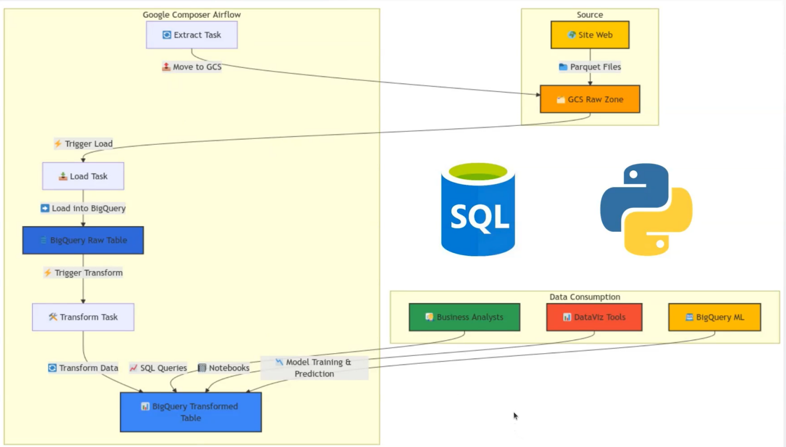

# Google Cloud Platform End to End ELT Pipeline

## 🎯 Business issues
**Development of data ingestion pipelines (ELT) on GCP for managing yellow Taxi orders in the city of New-York.**

**🏗️ ELT Workflow**
- Data ingestion in Google Cloud Storage (GCS) and loading into BigQuery.
- Data transformation and performance management in BigQuery.
- Orchestration and automation of pipelines with Apache Airflow.
- Data cleansing and manipulation with Python and SQL.
- Data analysis in BigQuery to solve business problems.
- Building and evaluating Machine Learning models directly in BigQuery through BigQuery ML.

[Workflow]()

**📊 Dataset**
- **Source** : [Datasets](https://www.nyc.gov/site/tlc/about/tlc-trip-record-data.page)
- **Features** : 30 variables

**📦 Deliverables**
- An end-to-end data ingestion pipeline orchestrated with Airflow.
- A business report to answer basic business questions.
- SQL views ready for further analyses by data and business analysts.
- A report on the prediction of Taxi orders prices through Machine Learning techniques.

**🛠️ Stack (Tools)**

1. **GCS**
2. **BigQuery**
3. **Cloud composer(Airflow)**
4. **Python**
5. **SQL**
6. **BigQuery ML**
